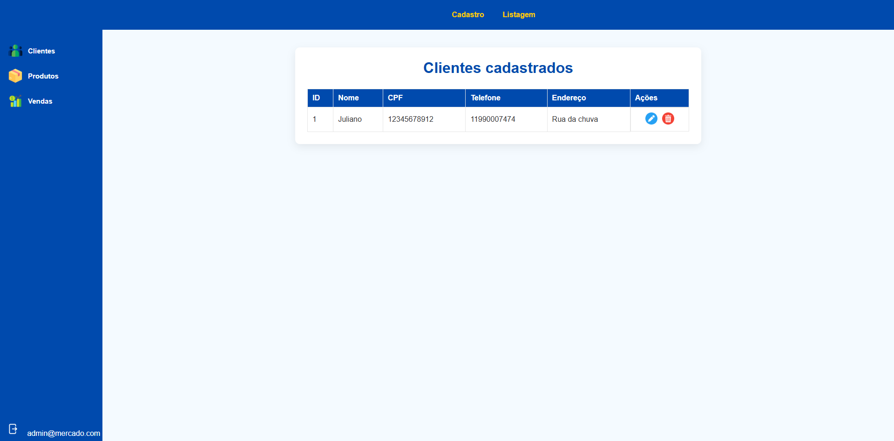
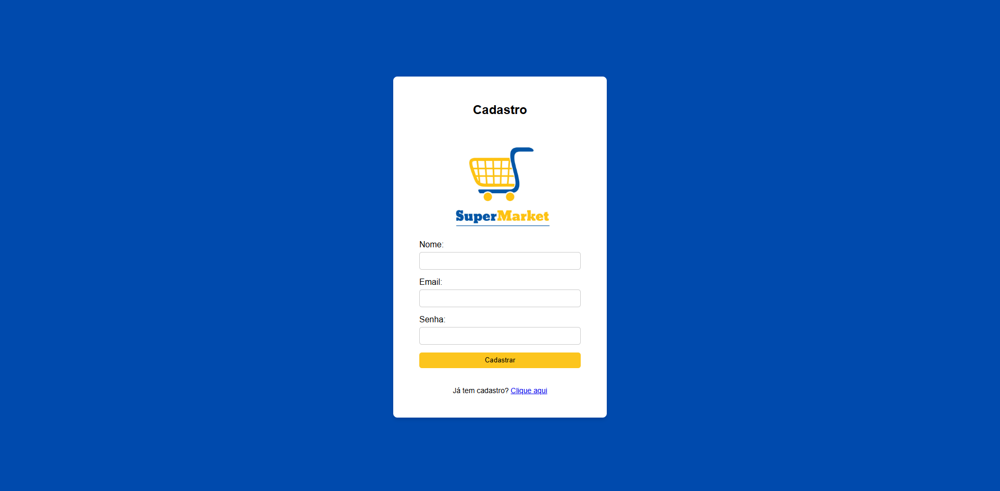

# 🛒 Projeto SuperMarket (Parte II)

Este repositório demonstra o funcionamento do sistema SuperMarket, que permite cadastrar produtos e clientes, registrar vendas de forma simples e acompanhar o histórico de transações. Para a parte 2 foram criados novos endpoints que permitem que a API seja acessada via WEB com HTML e Thymeleaf. O sistema desenvolvido com Java e Spring Boot, agora salva Clientes, Produtos e Vendas no Banco de Dados Postgres oferecido pelo Render, e o deploy está nessa mesma plataforma. Acessar a API via protocolos HTTP ainda é possível.

---
# 🔹 Pacotes utilizados e suas funções

### Modelo MVC

**1. Model:**
- Entity → Mapeia tabelas e relacionamentos no banco.
- Repository → Abstrai o acesso e consultas ao banco.
- Service → Implementa lógica e regras de negócio.

**2. View:**
- Static → CSS e imagens
- Templates → Páginas HTML

**3. Controller:**
- Controller HTTP → Expõe endpoints REST e manipula requisições/respostas.
- Controller WEB → Expõe endpoints e mapeia páginas WEB.
- Assembler → Constrói modelos HATEOAS para respostas enriquecidas.

**IDEs utilizadas:**
- Parte 1 → IntelliJ
- Parte 2 → Eclipse
---

## Configuração Inicial no Spring Initializr (CP4 - Parte 2)


---

## Deploy da API

O Deploy da aplicação foi feito no Render. Acesse os links abaixo e coloque o endpoint no final.

- Para retornar páginas ``HTML``:
https://cp4-java-sv3f.onrender.com/web/


- Para retornar em ``JSON``:
https://cp4-java-sv3f.onrender.com/api/


**Obs:** Para testar no  `localhost` é necessário acessar pela porta 8082, como especificado no ``application.properties``

---

## Endpoints

### JSON:
#### 👥 Clientes (`/api/clientes`)

| Método | URI                  | Descrição                                    |
|--------|----------------------|----------------------------------------------|
| GET    | `/api/clientes`      | Lista todos os clientes                      |
| GET    | `/api/clientes/{id}` | Busca cliente por ID                         |
| POST   | `/api/clientes`      | Cadastra um novo cliente                     |
| PUT    | `/api/clientes/{id}` | Atualiza um cliente existente (substituição) |
| PATCH  | `/api/clientes/{id}` | Atualiza parcialmente um cliente             |
| DELETE | `/api/clientes/{id}` | Exclui um cliente por ID                     |

#### 📦 Produtos (`/api/produtos`)

| Método | URI                   | Descrição                                      |
|--------|-----------------------|------------------------------------------------|
| GET    | `/api/produtos`       | Lista todos os produtos                        |
| GET    | `/api/produtos/{id}`  | Busca produto por ID                           |
| POST   | `/api/produtos`       | Cadastra um novo produto                       |
| PUT    | `/api/produtos/{id}`  | Atualiza um produto existente (substituição)   |
| PATCH  | `/api/produtos/{id}`  | Atualiza parcialmente um produto               |
| DELETE | `/api/produtos/{id}`  | Exclui um produto por ID                       |

#### 💰 Vendas (`/api/vendas`)

| Método | URI                  | Descrição                       |
|--------|----------------------|---------------------------------|
| GET    | `/api/vendas`        | Lista todas as vendas           |
| GET    | `/api/vendas/{id}`   | Busca venda por ID              |
| POST   | `/api/vendas`        | Registra uma nova venda         |
| PATCH  | `/api/vendas/{id}`   | Atualiza parcialmente uma venda |
| DELETE | `/api/vendas/{id}`   | Exclui uma venda por ID         |

---


### HTML: 
Estes controllers retornam páginas HTML, não JSON. E somente os GETs podem ser visualizados.

#### 👥 Clientes (`/web/clientes`)

| Método | URI                        | Descrição                                     | View retornada              |
|--------|----------------------------|-----------------------------------------------|-----------------------------|
| GET    | `/web/clientes/listar`     | Lista todos os clientes                       | `cliente/cliente-listar`    |
| GET    | `/web/clientes/formulario` | Exibe o formulário de cadastro/edição         | `cliente/cliente-form`      |
| GET    | `/web/clientes/editar/{id}`| Exibe o formulário preenchido para edição     | `cliente/cliente-form`      |
| POST   | `/web/clientes/salvar`     | Salva cliente (novo ou edição) e redireciona  | Redirect → `/listar`        |
| GET    | `/web/clientes/excluir/{id}`| Exclui cliente e redireciona para listagem   | Redirect → `/listar`        |

#### 📦 Produtos (`/web/produtos`)

| Método | URI                         | Descrição                                      | View retornada              |
|--------|-----------------------------|------------------------------------------------|-----------------------------|
| GET    | `/web/produtos/listar`      | Lista todos os produtos                        | `produto/produto-listar`    |
| GET    | `/web/produtos/formulario`  | Exibe o formulário de cadastro/edição          | `produto/produto-form`      |
| GET    | `/web/produtos/editar/{id}` | Exibe o formulário preenchido para edição      | `produto/produto-form`      |
| POST   | `/web/produtos/salvar`      | Salva produto (novo ou edição) e redireciona   | Redirect → `/listar`        |
| GET    | `/web/produtos/excluir/{id}`| Exclui produto e redireciona para listagem     | Redirect → `/listar`        |

#### 💰 Vendas (`/web/vendas`)

| Método | URI                       | Descrição                                       | View retornada            |
|--------|---------------------------|-------------------------------------------------|---------------------------|
| GET    | `/web/vendas/listar`      | Lista todas as vendas                           | `venda/venda-listar`      |
| GET    | `/web/vendas/formulario`  | Exibe o formulário de cadastro/edição           | `venda/venda-form`        |
| GET    | `/web/vendas/editar/{id}` | Exibe o formulário preenchido para edição       | `venda/venda-form`        |
| POST   | `/web/vendas/salvar`      | Salva venda (nova ou edição) e redireciona      | Redirect → `/listar`      |
| GET    | `/web/vendas/excluir/{id}`| Exclui venda e redireciona para listagem        | Redirect → `/listar`      |


---

## 🔄 Exemplos de Requisições JSON

- Exemplo de Request **Cliente**:
````json
{
    "nome": "Luis Cardoso",
    "cpf": "12345678901",
    "telefone": "11987654321",
    "endereco": "Rua Exemplo, 123 - São Paulo"
}
````

- Exemplo de Request **Produto**:
````json
{
    "nome": "Arroz 5kg",
    "codigo": "ARROZ001",
    "categoria": "Alimentos",
    "preco": 25.90,
    "dataValidade": "2025-12-31"
}
````

- Exemplo de Request **Venda**:
````json
{
    "clienteId": 1,
    "valorTotal": 100.50,
    "desconto": 10.00
}
````

---

## Páginas HTML



---

## Estrutura do Projeto

