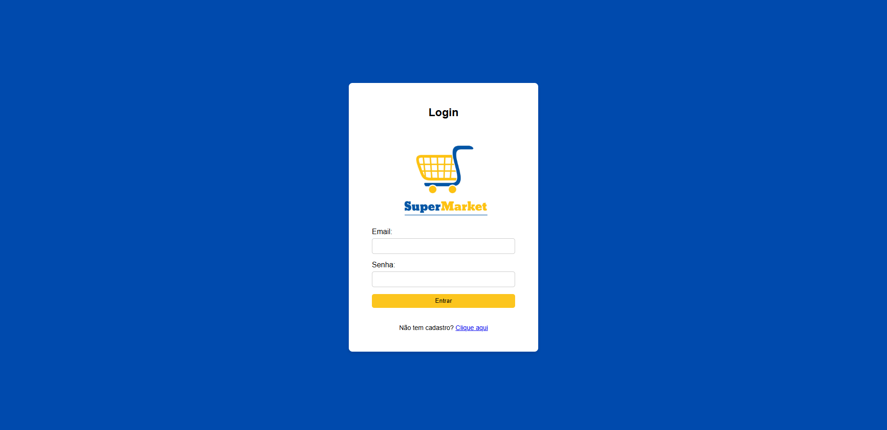
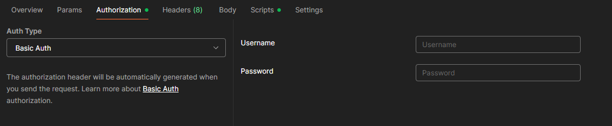

# 🛒 Projeto SuperMarket (CP5 - Parte II)

Este repositório demonstra o funcionamento do sistema SuperMarket, que permite cadastrar produtos e clientes, registrar vendas de forma simples e acompanhar o histórico de transações. Foram criados endpoints que permitem que a API seja acessada via WEB com HTML e Thymeleaf. E agora conta com mais segurança, uma vez que para ser acessada todos os usuários precisam estar autenticados com Spring Security. O sistema desenvolvido com Java e Spring Boot salva Clientes, Produtos e Vendas no Banco de Dados Postgres oferecido pelo Render, e o deploy está nessa mesma plataforma. Acessar a API via protocolos HTTP ainda é possível.


---
# 🔹 Pacotes utilizados e suas funções

### Modelo MVC

**1. Model:**
- Entity → Mapeia tabelas e relacionamentos no banco.
- Repository → Abstrai o acesso e consultas ao banco.
- Service → Implementa lógica e regras de negócio.
- Security → Regras de segurança da aplicação

**2. View:**
- Static → CSS e imagens
- Templates → Páginas HTML

**3. Controller:**
- Controller HTTP → Expõe endpoints REST e manipula requisições/respostas.
- Controller WEB → Expõe endpoints e mapeia páginas WEB.
- Assembler → Constrói modelos HATEOAS para respostas enriquecidas.

**IDEs utilizadas:**
- Parte 1 → IntelliJ
- Parte 2 → Eclipse
---

## Configuração Inicial no Spring Initializr (CP5- Parte 2)


---

## Deploy da API

O Deploy e o banco de daos estão no Render. Acesse os links abaixo e coloque o endpoint no final.

- Para retornar páginas ``HTML``:
https://cp5-java-lox5.onrender.com/


- Para retornar em ``JSON``:
https://cp5-java-lox5.onrender.com/api/


**Obs 1:** Para testar no  `localhost` é necessário acessar pela porta 8082, como especificado no ``application.properties`` e passar suas credenciais de acesso.

**Obs 2:** A página de login é acessada automaticamente ao informar o link no navegador, pois a mesma está configurada com `index.html`.

---

## Acesso / Usuários

Foram definidos dois usuários, assim que a aplicação inicia:
- **ADMIN:** tem permissão pra fazer o CRUD completo e acessar todas as telas do sistema.
- **USER:** tem permissão para acessar todas as telas e criar as entidades (GET e POST). 

Para acessar as telas, basta logar com um desses usuários:
| Email               | Senha     | Role (permissão)  |
| ------------------- | --------- | ----------------- |
| admin@mercado.com   | 123456    | ADMIN             |
| user@mercado.com    | 123456    | USER              |

**Obs:** todos os usuários criados a partir da tela de `Cadastro` recebem automaticamente a Role `USER`.



Para acessar via Postman, coloque o Email e Senha na sessão de Basic Auth antes de cada requisição:



**Obs:** todos os endpoints são acessados via **`localhost:8082`**

---

## Páginas HTML

### Login e Cadastro:


### Fomulário de cadastro e Listagem


### Acesso negado (somente para roles do tipo USER):


---


## Endpoints

### JSON:
#### 👥 Clientes (`/api/clientes`)

| Método | URI                  | Descrição                                    |
|--------|----------------------|----------------------------------------------|
| GET    | `/api/clientes`      | Lista todos os clientes                      |
| GET    | `/api/clientes/{id}` | Busca cliente por ID                         |
| POST   | `/api/clientes`      | Cadastra um novo cliente                     |
| PUT    | `/api/clientes/{id}` | Atualiza um cliente existente (substituição) |
| PATCH  | `/api/clientes/{id}` | Atualiza parcialmente um cliente             |
| DELETE | `/api/clientes/{id}` | Exclui um cliente por ID                     |

#### 📦 Produtos (`/api/produtos`)

| Método | URI                   | Descrição                                      |
|--------|-----------------------|------------------------------------------------|
| GET    | `/api/produtos`       | Lista todos os produtos                        |
| GET    | `/api/produtos/{id}`  | Busca produto por ID                           |
| POST   | `/api/produtos`       | Cadastra um novo produto                       |
| PUT    | `/api/produtos/{id}`  | Atualiza um produto existente (substituição)   |
| PATCH  | `/api/produtos/{id}`  | Atualiza parcialmente um produto               |
| DELETE | `/api/produtos/{id}`  | Exclui um produto por ID                       |

#### 💰 Vendas (`/api/vendas`)

| Método | URI                  | Descrição                       |
|--------|----------------------|---------------------------------|
| GET    | `/api/vendas`        | Lista todas as vendas           |
| GET    | `/api/vendas/{id}`   | Busca venda por ID              |
| POST   | `/api/vendas`        | Registra uma nova venda         |
| PATCH  | `/api/vendas/{id}`   | Atualiza parcialmente uma venda |
| DELETE | `/api/vendas/{id}`   | Exclui uma venda por ID         |

---


### HTML: 
Estes controllers retornam páginas HTML, não JSON. E somente os GETs podem ser visualizados.

#### 👥 Clientes (`/web/clientes`)

| Método | URI                        | Descrição                                     |
|--------|----------------------------|-----------------------------------------------|
| GET    | `/web/clientes/listar`     | Lista todos os clientes                       |
| GET    | `/web/clientes/formulario` | Exibe o formulário de cadastro/edição         |


#### 📦 Produtos (`/web/produtos`)

| Método | URI                         | Descrição                                      |
|--------|-----------------------------|------------------------------------------------|
| GET    | `/web/produtos/listar`      | Lista todos os produtos                        |
| GET    | `/web/produtos/formulario`  | Exibe o formulário de cadastro/edição          |


#### 💰 Vendas (`/web/vendas`)

| Método | URI                       | Descrição                                       |
|--------|---------------------------|-------------------------------------------------|
| GET    | `/web/vendas/listar`      | Lista todas as vendas                           |
| GET    | `/web/vendas/formulario`  | Exibe o formulário de cadastro/edição           |


---

## 🔄 Exemplos de Requisições JSON

- Exemplo de Request **Cliente**:
````json
{
    "nome": "Luis Cardoso",
    "cpf": "12345678901",
    "telefone": "11987654321",
    "endereco": "Rua Exemplo, 123 - São Paulo"
}
````

- Exemplo de Request **Produto**:
````json
{
    "nome": "Arroz 5kg",
    "codigo": "ARROZ001",
    "categoria": "Alimentos",
    "preco": 25.90,
    "dataValidade": "2025-12-31"
}
````

- Exemplo de Request **Venda**:
````json
{
    "clienteId": 1,
    "valorTotal": 100.50,
    "desconto": 10.00
}
````

---

## Estrutura do Projeto


